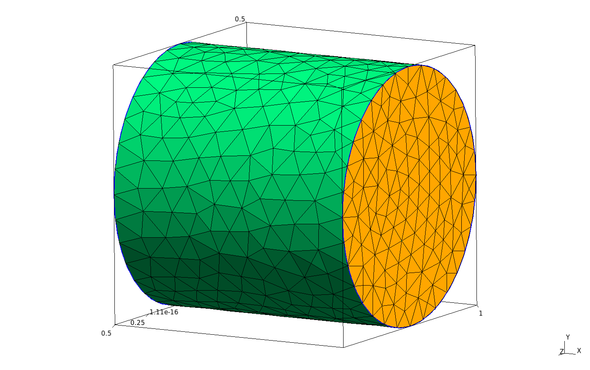
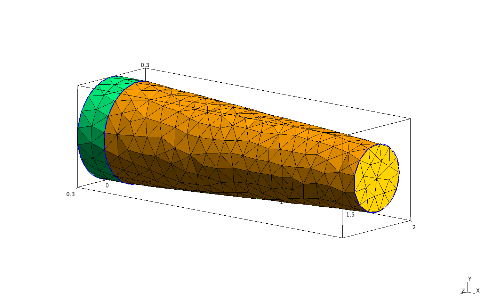
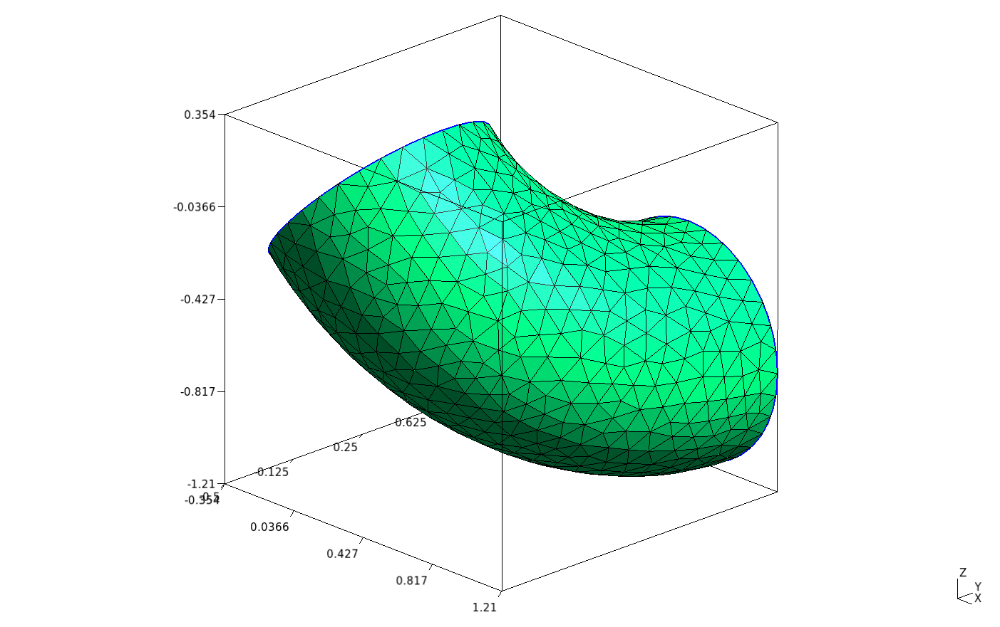
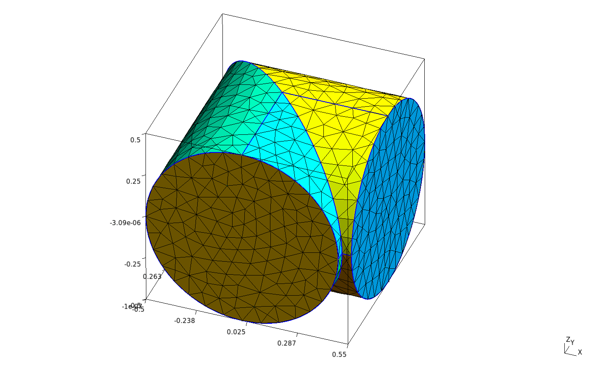
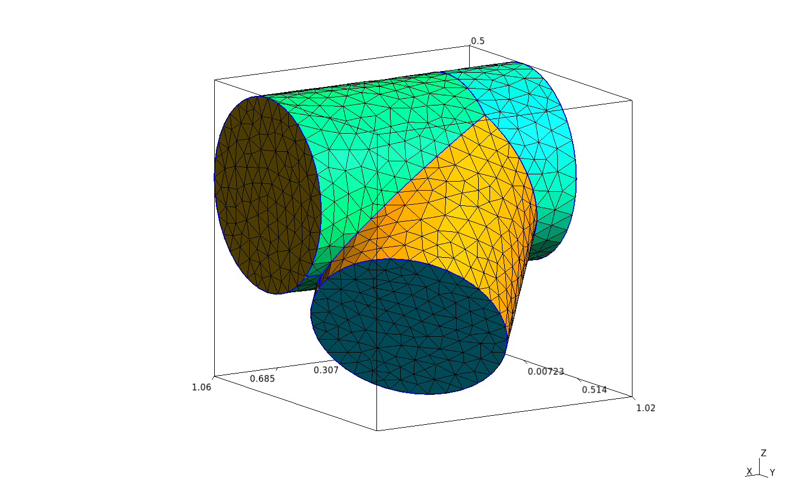
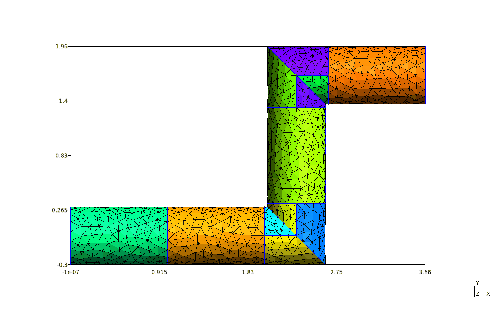
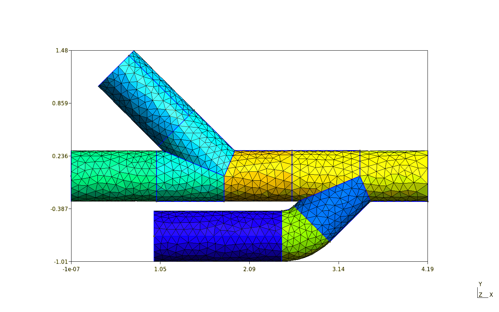

# GMSH Pipes
These tools use the GMSH-SDK (or GMSH API), available [here](http://gmsh.info/), but also uploaded here as *gmsh.py* and *libgmsh.so*.

## Installation
At the moment - just clone the repo and import the following files.

```python
import gmsh  # import before others.
import pieces
import pipes
```
The current way to start a file is:
```python
model = gmsh.model
mesh = model.mesh
gmsh.initialize()
gmsh.option.setNumber("Mesh.CharacteristicLengthMax", 0.1)  # max mesh length
gmsh.model.add("Example")  # optional, add a model name.
```

### pieces.py
Contains classes (and some useful functions for said classes) which represent cylindrical GMSH objects. The classes store information of the object, such as the centre and direction of its faces, as well as functions to update the information when transformations are applied to them. This makes the information a little easier to access than using just the GMSH API. The available pieces are:
* Cylinder

```python
piece = pieces.Cylinder(1, 0.5, [1,0,0], 0.1)
# Length, radius, direction, mesh size
```
* Cylinder with changing radius

```python
piece = pieces.ChangeRadius(2, 1.8, 0.3, 0.2, [1 ,0, 0], 0.1)
# length, change length, start radius, end radius, direction, mesh size
```
* Smooth bends

```python
piece = pieces.Curve(0.5, [1,0,-1], [0,1,0], 1, 0.2)
# radius of cylinder, in direction, out direction, bend radius, mesh size
```
* Mitered bends

```python
piece = pieces.Mitered(0.5, [0, 1, 0], [1, 0, 0], 0.2)
# radius of cylinder, in direction, out direction, mesh size
```
* T Junctions

```python
piece = pieces.TJunction(0.5, [1, 0, 0], [1, 1, -1], 0.1)
# radius, direction, t direction, mesh size
```

### pipes.py
Using the pieces above and the Network class, pipes and pipe networks can be easily built. A Network is started with:
```python
network = pipes.Network(1, 0.3, [1,0,0], 0.1)
```
Then added to using one of the following commands:
```python
network.add_cylinder(1, 0.1, out_number=1)
network.add_t_junction([-1,-1,0], 0.05)
network.add_curve([0,1,0], 0.5, 0.05)
network.add_mitered([0, 1, 0], 0.05, out_number=2)
```
Where out_number specifies which outlet of the pipe the piece will be added to. For more information on each function, the documentation is currently only within the files.

Examples:
* Chicane with mitered bends:

```python
network = pipes.Network(1, 0.3, [1,0,0], 0.1)
network.add_cylinder(1, 0.1)
network.add_mitered([0,1,0], 0.1)
network.add_cylinder(1, 0.1)
network.add_mitered([1,0,0], 0.1)
network.add_cylinder(1, 0.1)
```
* Pipe with two junctions:

```python
network.add_t_junction([-1,1,0], 0.05)
network.add_t_junction([-1,-1,0], 0.05)
network.add_cylinder(1, 0.1, out_number=2)
network.add_curve([-1,0,0], 0.5, 0.05, out_number=3)
network.add_cylinder(1.5, 0.1, out_number=3)
```

Once the network is complete, you can fuse the objects together and create physical surfaces and volumes, and set the local mesh sizes. Information can be obtained and written to file.
```python
network.set_physical_groups()
network._set_mesh_sizes()
network.write_info("info.csv")
```

the mesh can be created and saved using:
```python
mesh.generate(3)
gmsh.option.setNumber("Mesh.Binary", 1)  # 1 for binary, 0 for ASCII
gmsh.write(filename.msh)  # .msh2 for legacy format
```
To view the mesh in the GMSH GUI, call
```python
gmsh.fltk.run()
```

To finish, and end use of gmsh, call
```python
gmsh.finalize()
```

### Requirements for pipes.py:
- libgmsh.so and gmsh.py, from the GMSH SDK or this repository.
- NumPy, SciPy
